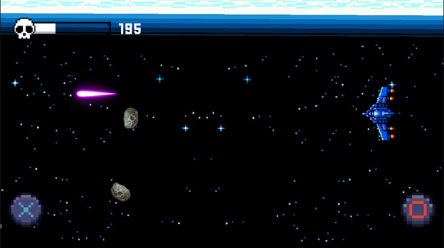
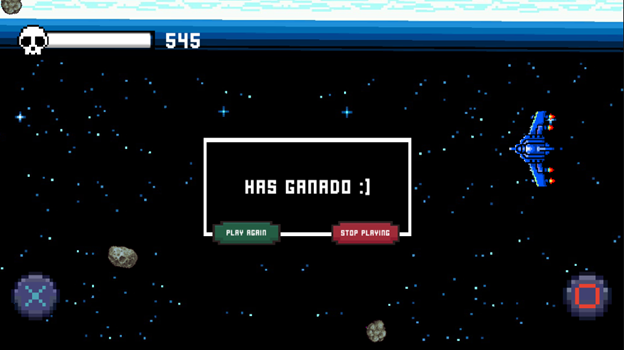

# ATLAS
## Score System
The class ScoreManager serves as the game controller do to its inclusion of multiples other classes. The main aspect of the ScoreManager is the deployment of text that represents the score of the player and verifying if the player has reached the max quantity of points meaning he won, if he reached the max, a pop-up message will be deployed pausing the game though the timescale function, elsewhere it deploys a message telling the player he lost.
```csharp
public void endGame()
    {
        if (score >= 500)
        {
            popup.TitleUIText.text = "Has ganado :)";
            audio.clip = winMusic;
        }
        else
        {
            popup.TitleUIText.text = "Has perdido :(";
            audio.clip = loseMusic;
        }
        Time.timeScale = 0;
        audio.Stop();
        audio.Play();
        popup.setActive(true);
    }
```
Another one of the mechanics that we can find in this class is the definition of the value of the slider representing the quantity of points the player has, and a reduction of 5 points to the score every 10 seconds.
```csharp
void decreasePoints()
    {
        if (score > 5)
        {
            score -= 5;
        }
        else if(score <= 5)
        {
            score = 0;
        }
        ScoreText.text = score.ToString();
        HealthBar.SetHealth(score);
    }
```

In-game score is assigned in reference to the asteroids. These uses a random sprite from a sprite array generated from the asteroid spritesheet. It's thanks to the isSmall bool value that the score for small asteroids is 10 points while the others are only worth 1.
```csharp
Sprite randSprite( Sprite[] sprites)
    {
        int index = Random.Range(0,sprites.Length);
        Debug.Log("Asteroide: " + sprites[index].name);
        if (index == 2) isSmall = true;
        return sprites[index];
    }
```

## Visual Representation
### Gameplay


### End Screen


## Credits
Contains music by Joshua McLean (https://joshua-mclean.itch.io), ChillMindscapes (https://chillmindscapes.itch.io) and OmegaBagel (https://youtube.com/OmegaBagel).
SFX by GameSupplyGuy (https://gamesupply.itch.io).
Licensed under Creative Commons Attribution 4.0 International